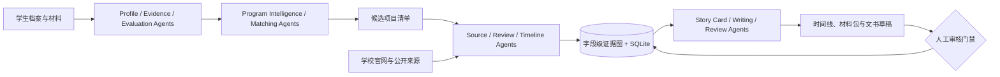

<div align="center">

# ⚓ HarborPilot MultiAgent

**面向港新硕士申请的可信多智能体辅助平台**

把学生背景、项目库、官方来源、社区经验、文书素材和人工审核串成一条可追踪的申请准备链路。

[](https://www.python.org/)
[](https://fastapi.tiangolo.com/)
[](https://nextjs.org/)
[](https://react.dev/)
[](#-真实性门禁)

[核心能力](#-核心能力) · [系统架构](#️-系统架构) · [快速开始](#-快速开始) · [页面与 API](#-页面与-api) · [真实性门禁](#-真实性门禁)

</div>

---

## 📖 项目简介

**HarborPilot** 是一个面向香港、新加坡授课型硕士申请的信息辅助平台。它服务于项目发现、初步选校、材料规划、文书素材整理和数据可信度审计，但不会把未经核验的信息包装成确定结论。

与只做“推荐列表”的申请工具不同，HarborPilot 将每个关键字段绑定到来源、申请季、采集时间、页面哈希、证据片段和人工审核状态，并把多智能体的职责、输入、输出和门禁公开为可审计契约。

> 💡 一句话概括：**让申请建议不仅有结果，还能说明依据、时效和可信度。**

## ✨ 核心能力

- 👤 **背景评估** —— 读取学校层级、GPA 标尺、语言成绩、方向、预算、经历与职业目标，输出竞争力分层、硬门槛和资料缺口。
- 🧭 **项目推荐** —— 基于港新项目库、方向识别、确定性规则和数据可信度生成冲刺、主申、保底、候选与暂不建议项目。
- 📦 **项目数据包** —— 聚合官方要求、字段覆盖、课程内容、申请时间线、文书题目、社区经验和待核验事项。
- 🕸️ **多智能体编排** —— Profile、Evidence、Evaluation、Matching、Source、Timeline、Writing、Review 等 Agent 分工协作。
- 🔍 **来源采集与证据图** —— 支持 robots 检查、页面快照哈希、字段候选、来源冲突和公开社区信号。
- ✅ **人工审核发布** —— 只有逐字段人工确认后，候选数据才能成为 `OFFICIAL_VERIFIED_CURRENT`。
- ✍️ **文书工作台** —— 用问卷、故事卡、事实绑定和审核量表组织 PS / SOP / CV / Essay / 推荐信素材。
- 🧪 **场景自审** —— 用多类典型申请背景回归推荐质量、数据门禁和风险提示。

## 🏗️ 系统架构



### Agent 分层

| 层级 | 代表 Agent | 主要职责 |
| --- | --- | --- |
| 用户理解 | Profile、Evidence、Evaluation | 背景归一化、材料缺口、竞争力与硬门槛 |
| 项目智能 | Program Intelligence、Matching | 项目方向识别、分档与风险解释 |
| 数据可信 | Source、Acquisition、Review | 官方来源采集、冲突检测、字段级审核发布 |
| 申请执行 | Timeline、Writing、Writing Review | 时间线、材料规划、事实绑定与草稿复核 |

## 🛠️ 技术栈

| 领域 | 选型 |
| --- | --- |
| 后端 | Python 3.11+、FastAPI、Pydantic、Uvicorn |
| 前端 | Next.js 15、React 19、TypeScript、Lucide |
| 数据 | SQLite、JSON 项目快照、字段级证据记录 |
| 模型 | OpenAI-compatible API；默认支持无 Key 的 mock 模式 |
| 采集 | HTTP 抓取、robots 检查、页面哈希、可选浏览器/PDF 解析 |
| 部署 | Docker Compose |
| 质量 | Pytest、Ruff、场景审计、前端类型检查 |

## 🚀 快速开始

### 1. 后端

```bash
git clone https://github.com/ZorIgn/HarborPilot-MultiAgent.git
cd HarborPilot-MultiAgent

python -m venv .venv
# Windows PowerShell
.\.venv\Scripts\Activate.ps1

python -m pip install -e ".[dev,llm]"
python -m uvicorn harbor_agent.app:app --reload --host 127.0.0.1 --port 8000
```

默认 mock 模式无需 API Key。使用真实模型前，请配置管理员令牌：

```powershell
$env:HARBOR_AGENT_ADMIN_TOKEN="change-this-local-admin-token"
```

### 2. 前端

```bash
cd web
npm install
npm run dev
```

打开 <http://localhost:3001>。后端默认允许 `localhost:3001` 和 `127.0.0.1:3001` 跨端口访问。

前端 `dev` 使用独立的 `next-dev` 输出目录，`build/start` 使用 `next-build`，避免开发服务和生产构建共用 `.next` 后出现缺 chunk 的 500。若 3001 曾经跑过旧进程，先停止旧 Node 进程再重新执行 `npm run dev` 或 `npm run start`。

### 3. Docker

```bash
docker compose up --build
```

## 🖥️ 页面与 API

### 主要页面

| 页面 | 用途 |
| --- | --- |
| `/assessment` | 背景竞争力评估 |
| `/programs` | 港新项目库与申请分档 |
| `/timeline` | 逐项目时间线与材料 |
| `/writing` | 文书工作台 |
| `/agent-lab` | 数据中心、来源证据与 Agent 契约 |
| `/settings` | 管理员模型设置 |

### 关键 API

| 方法 | 路径 | 用途 |
| --- | --- | --- |
| `GET` | `/api/programs` | 查询项目库 |
| `GET` | `/api/programs/{program_id}/trust` | 查看项目可信度 |
| `GET` | `/api/programs/{program_id}/data-package` | 获取项目数据包 |
| `GET` | `/api/evidence-graph/summary` | 查看证据图摘要 |
| `GET` | `/api/agent-system` | 查看 Agent 契约 |
| `GET` | `/api/admin/review-queue` | 获取字段审核队列 |
| `POST` | `/api/admin/review-queue/publish` | 人工确认后发布字段 |
| `POST` | `/api/workflows/program-plan` | 生成项目规划 |
| `POST` | `/api/workflows/writing-plan` | 生成文书素材计划 |

## 🛡️ 真实性门禁

- **官方字段优先**：截止日期、学费、语言要求、材料清单、申请入口和文书题目必须来自学校官方页面、官方 PDF / FAQ 或公开申请系统。
- **社区信息分层**：论坛、视频和公开经验只用于准备建议、项目别名与面试线索，不能覆盖官方要求。
- **字段级证据**：关键字段保留 URL、申请季、采集时间、page hash、证据片段、状态和人工审核标记。
- **冲突优先阻断**：新的来源冲突会阻止旧值继续作为正式结论，直到更新的人工核验记录解除冲突。
- **安全采集**：拒绝 HTTP、localhost、私网/保留地址、非 443 端口和不安全跳转，降低 SSRF 风险。
- **文书事实绑定**：英文事实未完成翻译或项目来源不足时，正式导出会被阻断或保留复核标记。

## 🔄 数据维护

首次启动会将 `data/programs_2027_fall.json` 导入本地 SQLite：

```bash
python scripts/seed_program_store.py
```

默认 dry-run 的项目信息更新：

```bash
python scripts/run_harborpilot_update.py --max-programs 48
```

写入审核队列但不自动发布：

```bash
python scripts/run_harborpilot_update.py --write --max-programs 48
python scripts/run_agent_worker.py --enqueue-catalog-refresh --write --max-jobs 20
```

## 📂 项目结构

```text
src/harbor_agent/   Agent、工作流、API、证据与数据层
web/                Next.js 15 管理端与学生端
data/               项目快照和本地数据库种子
scripts/            数据更新、队列 worker、场景审计
tests/              后端单元与集成测试
examples/           示例与演示入口
docs/               设计和使用文档
```

## 🧪 验证

```bash
python -m pytest -q
python scripts/run_scenario_audit.py

cd web
npx tsc --noEmit --incremental false
npm run build
```

## ⚠️ 当前边界

HarborPilot 是可信申请信息辅助原型，不替代学校官网、正式顾问或招生部门的最终确认。项目库中仍可能存在上一申请季参考、抽取候选或待人工确认字段；正式使用前应完成当前申请季官方字段的逐项审核发布。
