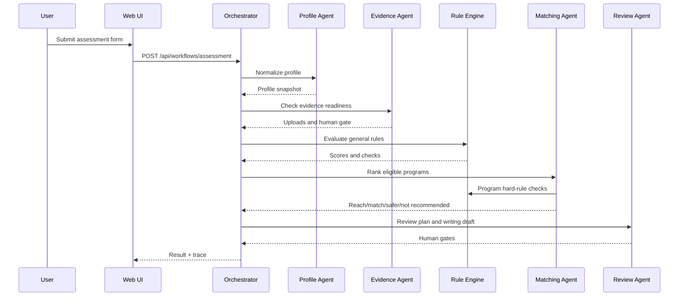

# Agent Workflow

The project follows the outline's core principle: multi-agent does not mean several chatbots talking freely. It means specialized units with constrained inputs, tools, and schemas.

## Workflow



## LLM Mode

Default:

```bash
HARBOR_AGENT_LLM_MODE=mock
```

Real smoke test with environment variables:

```bash
set OPENAI_API_KEY=sk-...
set HARBOR_AGENT_LLM_PROVIDER=openai
python scripts/run_real_agent_smoke.py
```

The web UI can also configure DeepSeek, OpenAI, or another OpenAI-compatible endpoint after startup. The LLM is only used for explanation and drafting. GPA, language requirements, prerequisites, and unpublished-field gates are deterministic.
