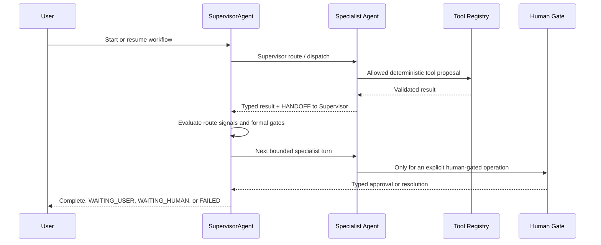

# Agent Workflow

HarborPilot uses a Supervisor-mediated runtime. “Multi-agent” means that
specialized roles have separate tool allowlists and typed outputs; it does not
mean that several models freely hand work to one another.

## Actual execution topology


```mermaid
sequenceDiagram
  participant U as User
  participant S as SupervisorAgent
  participant A as Specialist Agent
  participant T as Tool Registry
  participant H as Human Gate

  U->>S: Start or resume workflow
  S->>A: Supervisor route / dispatch
  A->>T: Allowed deterministic tool proposal
  T-->>A: Validated result
  A-->>S: Typed result + HANDOFF to Supervisor
  S->>S: Evaluate route signals and formal gates
  S->>A: Next bounded specialist turn
  A->>H: Only for an explicit human-gated operation
  H-->>S: Typed approval or resolution
  S-->>U: Complete, WAITING_USER, WAITING_HUMAN, or FAILED
```

The execution graph contains only these two transition classes:

```text
SupervisorAgent -> AssessmentAgent | ResearchAgent | MatchingAgent
SupervisorAgent -> VerificationAgent | PlanningAgent | WritingAgent | CriticAgent
SpecialistAgent -> SupervisorAgent
```

Most live states intentionally expose one legal Supervisor route: a missing
profile field, unresolved official source, or formal gate is a dependency, not
a prompt for the model to invent parallel work. The route set becomes plural
only where work is genuinely independent and non-escalating—for example,
bounded source-plan preparation and student story-card preparation while
verification is pending, or fact-bound writing and timeline construction after
verification. This is policy-safe dynamic routing, not unrestricted agent
autonomy.

There are no `CriticAgent -> MatchingAgent`, `CriticAgent -> VerificationAgent`,
`CriticAgent -> WritingAgent`, `MatchingAgent -> ResearchAgent`, or
`VerificationAgent -> VerificationAgent` execution edges. Those outcomes are
signals written by a specialist and consumed on the next Supervisor turn. For
example, `CriticAgent` may report `REVERIFY`; the Supervisor then decides
whether the current policy state permits a new `VerificationAgent` turn. This
keeps the real path explicit as:

```text
Specialist -> Supervisor -> Specialist
```

`can_handoff(source, target)` is an executor-boundary check, not a route-opening
compatibility fallback. A specialist may return only to `SupervisorAgent`; only
`SupervisorAgent` may select a specialist target. Unknown sources and direct
specialist-to-specialist targets are rejected; a legacy/plug-in unknown source
may only use the safe fallback of returning to `SupervisorAgent`.

## Default mode and real data modes

The default runtime is deterministic/mock and offline:

```bash
HARBOR_AGENT_LLM_MODE=mock
```

The default HTTP construction path does not inject a live LLM provider. The
default source acquisition mode is also `mock`; it does not contact the public
web. Setting `dry_run=false` alone is not permission to make network requests.

The `refresh_official_sources` flag on a runtime workflow is an explicit
source-tool request, not a verification or publication result. It is enabled
only when the caller also names known programme IDs, sets
`source_connection_mode=real|hybrid`, and the API injects a server-validated
operator authorization. In `mock` mode, with no scope, or without that
authorization, it cannot contact the public web. It keeps the same
Verification-only tool boundary and human publication gate; operator-run live
acquisition should use the controlled endpoint and `connection_mode` contract
below.

For an explicitly controlled acquisition run, an operator can use
`DataAcquisitionRequest.connection_mode` as follows:

| Mode | Network behavior | Formal-use behavior |
| --- | --- | --- |
| `mock` (default) | No live request; produces a dry-run plan | No new verified fact is created |
| `real` | Fetches allowlisted official sources after admin/scope checks | Snapshot → extraction → candidate → human review → publish; fetch success alone is never verification |
| `hybrid` | Uses retained snapshots plus an explicit real refresh | Same review and publish gates; failed real refresh cannot silently become a mock fact |

The live path is auditable through source snapshots, page hashes, extraction
candidates, exact source binding, review records, and published field facts.
The current formal coverage is reported by `GET /api/admin/decision-coverage`;
catalog size is not evidence coverage.

The controlled entry point is `POST /api/workflows/data-acquisition`. A live
run must set both `dry_run=false` and `connection_mode=real|hybrid`, pass the
admin/operator check, and name known programme IDs. Supervisor owns routing;
Verification is the only Specialist allowed to enter this path. Research cannot
turn a bounded source plan into a network request by itself.

## Agent responsibilities and boundaries

| Role | Allowed responsibility | Explicit boundary |
| --- | --- | --- |
| `SupervisorAgent` | Split tasks, select one currently legal specialist route, handle pauses and terminal status | Does not execute tools or bypass admissions/formal gates |
| `AssessmentAgent` | Normalize profile and identify missing inputs | Does not invent student facts or eligibility |
| `ResearchAgent` | Recall and narrow the deterministic catalog; build a bounded official-source research plan | Does not perform unrestricted web research, fetch pages, extract fields, bind sources, review candidates, or publish facts |
| `MatchingAgent` | Evaluate admissions, finances, preference, applicant fit, and portfolio composition | Does not turn unverified catalog values into hard qualification or budget facts |
| `VerificationAgent` | Inspect evidence readiness and, when explicitly enabled, drive the controlled source pipeline | It is the only runtime specialist allowed to enter snapshot/extract/bind/review tools; candidates remain non-formal until human publication |
| `PlanningAgent` | Build preparation and evidence-gated official timelines | Does not make an unverified deadline formal |
| `WritingAgent` | Retrieve grounded student/program facts, build story cards, and draft | Grounding validation must pass before `writing_ready` can be true |
| `CriticAgent` | Run recommendation, source, writing, and formal gates | `BLOCKED` remains blocked after a failed reverify; it cannot convert missing sources into a field-level `PASS` or Critic `FORMAL_PASS` |

## Model proposal contract

When model-driven mode is enabled, the model is proposal-only. It does not gain
authority to mutate runtime state or control the execution graph:

- Specialist models see only the exact policy-approved tool calls for the
  current state. They may select a non-empty subset, but cannot change tool
  names or arguments.
- Specialist models cannot set `next_agent` to a peer, replace a user/human
  question, or write a shared `state_patch`. Their deterministic policy owns
  the return to `SupervisorAgent`.
- The Supervisor model sees only currently available route targets. The
  runtime owns route state patches and rejects invented targets, self-routes,
  tool calls, and unvalidated patches.
- The executor revalidates the final `AgentDecision`, tool allowlist, handoff
  graph, terminal ownership, and state-field ACLs before performing any action.

This separation allows an LLM to help select or explain an action without
granting it tool-argument, routing, or state-mutation authority.

## Source verification path

`ResearchAgent` first calls catalog recall and then
`build_source_research_plan`. The plan is bounded by program, URL, field, and
registry limits; it permits only HTTPS official institution domains and does
not fetch or publish data.

Only the Verification route can enter the runtime source workflow:

```text
discover official source
  -> snapshot official source
  -> extract typed candidates
  -> exact source binding (human approval)
  -> save review candidate (human approval)
  -> reviewer publication
  -> published DecisionFact / ResolvedProgramView
```

The source text is untrusted and extraction output is only a candidate. A
successful fetch, parser result, or persisted review candidate is not a formal
fact. Publication must include the current cycle, source scope, source URL,
snapshot URL, page hash, evidence snippet, reviewer identity, review decision,
and a matched program binding. Missing any required provenance leaves the field
`UNKNOWN` for formal decisions.

For the rationale and the single-fact-layer migration details, see the
[trustworthy data remediation plan](trustworthy-agent-data-remediation-plan.md).

## Decision and writing gates

Catalog `Program` records are useful for recall and display. Hard qualification,
hard budget caps, official timelines, and formal recommendations read the
canonical `DecisionFact` projection through `ResolvedProgramView`. At the
field level the result is `PASS`, `FAIL`, or `UNKNOWN`:

- `PASS`/`FAIL` requires a current, reviewed, formally usable fact;
- absent, stale, previous-cycle, conflicted, community-only, or incomplete
  provenance produces `UNKNOWN` and cannot create a hard rejection or formal
  recommendation;
- conflicting current facts remain unresolved until an exact human decision.

`portfolio_required` is a hard admissions fact, not a writing preference. It
is formal only when a reviewed official record gives an explicit boolean. A
missing/ambiguous portfolio statement is `UNKNOWN`, so it cannot create a hard
pass or reject. The same fail-closed rule applies to GPA scale: a source value
such as `3.6/4.0` is preserved as candidate text until a reviewer publishes an
explicit 100-point value; the runtime does not silently convert it.

The Critic has separate readiness states:

```text
FORMAL_PASS          all required formal gates pass
PRELIMINARY_COMPLETE background, exploration recommendation, or preparation
                       plan with explicit blockers and formal_use_ready=false
BLOCKED              one or more gates remain unsupported or conflicted
```

After a source reverify is exhausted, missing grounding can never be written as
`PASS` or `FORMAL_PASS`. `PROGRAM_RECOMMENDATION` and
`APPLICATION_PLANNING` may safely end as `PRELIMINARY_COMPLETE` only with
explicit source blockers; this produces a non-formal exploration/preparation
artifact. Writing and full-application delivery remain `BLOCKED`. For writing
workflows, ClaimGraph validation must explicitly pass before the runtime can
set `writing_ready=true`.

## LLM mode

Default:

```bash
HARBOR_AGENT_LLM_MODE=mock
```

An operator can configure an OpenAI-compatible provider for a controlled model
run. This changes model proposal generation only; it does not change the
deterministic eligibility, evidence, formal-gate, handoff, or state ACLs. A
live model run should be evaluated separately from deterministic/mock tests.

## Runtime contract and trace

`GET /api/agent-system` exposes the instantiated agent contracts and checks.
`GET /api/agent/workflows/{id}/trace` records Supervisor routes, specialist
turns, tool calls/results, checkpoints, human gates, and terminal status. A
`HANDOFF` from a specialist is always a return to `SupervisorAgent`; the next
specialist is represented by the following `SUPERVISOR_ROUTE` event.

The runtime is bounded by workflow steps, agent turns, tool rounds, total tool
calls, and Supervisor replans. Limits and checkpoints are persisted so a
`WAITING_USER` or `WAITING_HUMAN` workflow can resume without skipping the
same policy gates.
