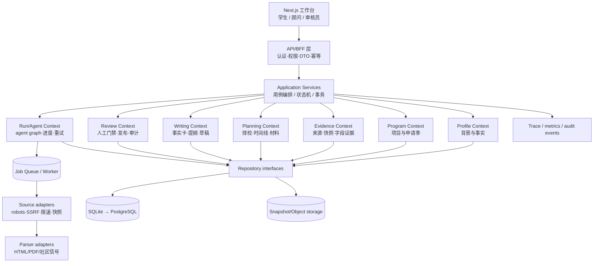
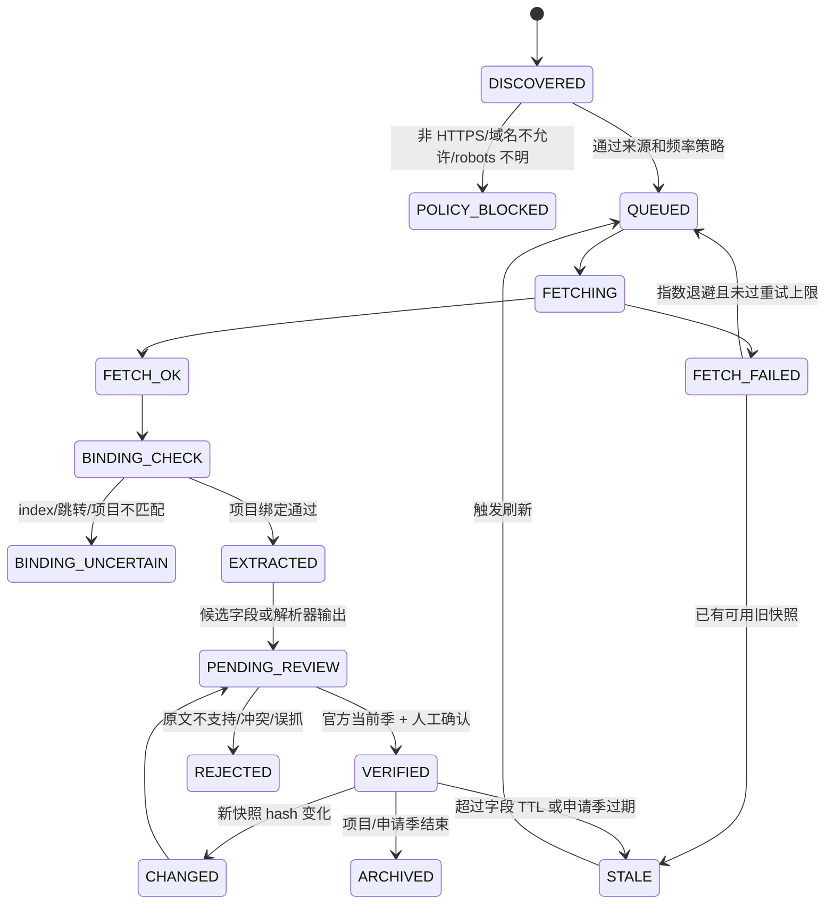

# HarborPilot v2 架构与信息可信供应链设计

> 本文是 HarborPilot 多 agent 留学辅助平台的重构蓝图。它把“能回答问题”改成“能被学生、顾问和审核员共同核验的申请工作台”：先收集并确认学生事实，再给出可解释的择校建议；学生选定项目后，只使用当前申请季、带来源和快照的学校信息编排准备计划；文书 agent 只能使用已确认的经历事实，并保留人工修改权。

## 1. 产品定位与审计结论

### 1.1 定位

HarborPilot 面向申请香港、 新加坡授课型硕士的学生和小型顾问团队，提供四个连续但可独立复用的工作流：

1. **背景评估**：把教育、语言、经历、预算和目标结构化，区分“学生自报”和“已核验事实”。
2. **择校与项目解释**：在硬性门槛通过后，按匹配度、风险和信息完整度分档；每一个结论都能追溯到规则或证据。
3. **申请季规划**：以当前申请季的官方截止日期为锚点，把材料准备拆成可执行任务；未知或过期日期不能驱动正式时间线。
4. **文书工作台**：从经历表生成事实卡、提纲和草稿，显示每个事实的来源、确认状态和待补证据，最终由学生决定是否采用。

平台不是录取概率预测器、自动代投系统或“保录”服务。没有官方证据的字段必须明确显示“未发布/待审核/社区参考”，而不是用模型补全。

### 1.2 本轮全面审计的主要结论

当前版本已经具备可信化改造的基础：有 142 个港新项目目录、规则门禁、来源注册表、robots 检查、快照/hash、字段证据图、人工审核队列和 SQLite 工作流状态。但它仍是**可工作的模块化单体雏形**，不是可长期演进的生产平台。

需要优先解决的结构性问题如下：

| 优先级 | 观察到的问题 | 用户/运营后果 | v2 处理原则 |
| --- | --- | --- | --- |
| P0 | API 路由、编排、序列化和错误处理集中在单一入口；部分 agent 文件过大 | 修改一个模块容易影响全部流程，测试边界不清 | 按领域拆分 router、application service 和 domain contract，先保持模块化单体 |
| P0 | 信息获取是“计划/执行/解析/发布”多种职责的组合，失败重试、幂等和运行指标不统一 | 学生不知道信息何时抓取、为何不可用；运营无法定位失败来源 | 用 Acquisition Run/Job/Attempt 状态机统一生命周期；所有字段绑定快照和审计事件 |
| P0 | “当前季”“上一季”“社区经验”“模型推断”已经有枚举，但在消费端容易被混用 | 过期截止日期可能进入时间线，社区经验可能被误读为学校要求 | 以字段级 publish gate 和消费前 capability check 强制阻断 |
| P1 | 目录、证据、审核、个人工作区分别有存储逻辑；本地 SQLite 缺少清晰的迁移和租户边界 | 数据难以备份、回滚和解释；并发运行风险高 | 统一 repository 接口、迁移版本、事务边界；后续可平滑换 PostgreSQL |
| P1 | 同步请求承担长时间抓取和工作流编排 | 页面超时、重复抓取、无法查看进度 | API 只创建 run，worker 执行；前端订阅轮询/事件进度 |
| P1 | 信息可信度在详情页可见，但缺少跨项目的来源健康、覆盖率和待办闭环 | 学生无法比较“哪个项目资料更可靠”，顾问无法排优先级 | 加 Source Health、Coverage、Review SLA 和 next action 视图 |
| P2 | UI 已有多页工作台，但错误、空状态和移动端信息层级仍偏工程化 | 新用户不知道下一步，低覆盖项目看起来像产品故障 | 以“状态—影响—下一步—证据”四段式反馈重写关键状态 |

### 1.3 与市场产品的差异化结论

市场产品已经验证了“探索—规划—申请—到校”的连续旅程：

- [ApplyBoard](https://www.applyboard.com/) 强在大规模院校/项目目录、申请服务和多目的地覆盖；HarborPilot 不应复制其渠道规模，应在港新项目的字段级证据和申请季解释上做深。
- [Cialfo](https://www.cialfo.co/) 强在学生、顾问、学校协同，包含 profile、探索、任务和进度；HarborPilot 应补齐角色权限、任务协同和可审计变更记录。
- [Unibuddy](https://unibuddy.com/products/the-unibuddy-platform/) 强在学生大使、社区问答和 AI-to-human handoff；HarborPilot 可把社区经验作为标注清晰的参考信号，但绝不能覆盖官方要求。
- [GradRight](https://gradright.com/) 强在择校与融资/成本决策；HarborPilot 应把预算硬门槛、学费证据和风险解释做成可复核的数据，而不是只输出排名。
- 开源申请项目（例如 [EZCollegeApp](https://github.com/ezcollegeapp-public/ezcollegeapp-public)、[Global-CS-application](https://github.com/Global-CS-application/global-cs-application.github.io)）说明“官方资料检索 + 人工控制 + 不自动提交”是可复用方向；HarborPilot 的壁垒应放在证据生命周期和港新申请季数据，而不是再做一个通用聊天机器人。

因此，v2 的竞争策略是：**窄区域、强证据、可解释、可协同**。先成为“可信的港新申请信息操作系统”，再扩展国家和服务。

## 2. v2 目标架构：模块化单体，异步边界优先

第一阶段不拆成微服务。把领域边界、数据库接口、消息契约和异步运行边界先做清楚，既降低部署复杂度，又为日后拆分保留路径。



### 2.1 目录与依赖规则

建议的目标目录（可以分阶段迁移，旧 import 通过 facade 兼容）：

```text
src/harbor_agent/
  api/                    # 仅 HTTP：request/response、鉴权、错误映射
    routers/{profile,programs,evidence,planning,writing,reviews,runs}.py
  application/            # 用例：AssessProfile、BuildShortlist、CreateRun…
  domain/
    profile/              # profile、fact、completeness
    catalog/              # institution、program、cycle、requirements
    evidence/             # source、snapshot、candidate、field evidence
    planning/             # shortlist、timeline、material task
    writing/              # story card、outline、draft、fact binding
    review/               # gate、decision、publication
    shared/               # IDs、clock、result/error、enums
  agents/                 # 窄职责 agent；只调用 application ports
  infrastructure/
    persistence/          # repositories、migrations、unit of work
    acquisition/          # HTTP/PDF/search adapters、robots、rate limit
    llm/                   # provider adapter；输出必须回到 schema/gate
    observability/        # trace、metrics、audit sink
  workers/                # run/job worker 和重试调度
```

依赖只能由外向内：`api → application → domain`；`infrastructure` 实现 domain/application 声明的 port。domain 不导入 FastAPI、Playwright、LLM SDK 或文件路径。agent 不是新的业务层，而是完成单一决策/抽取步骤的可观测组件。

### 2.2 统一 Run/Agent 合约

每一次背景评估、项目信息获取、刷新、时间线或文书生成都创建一个 `run`：

```text
run_id, tenant_id, profile_id, workflow_type, target_cycle,
status, requested_by, idempotency_key, started_at, finished_at,
input_snapshot_hash, output_version, error_code, trace_id
```

每个 agent step 记录：`step_id、agent_name、input_refs、output_refs、status、attempt、duration_ms、tool_calls、human_gate、error`。输出只允许是版本化 Pydantic contract；自由文本必须绑定到事实/证据引用。HTTP 请求返回 `202 + run_id`（dry-run 可同步返回预览），客户端通过 `GET /api/runs/{run_id}` 读取进度。

## 3. 信息获取 Agent：可信证据供应链

### 3.1 核心原则

1. **来源先于答案**：任何正式字段先问“来自哪一页、哪个申请季、何时抓取、是否看过原文”。
2. **字段级而非页面级可信度**：同一页面的学费可能已更新，截止日期可能仍是上一季；每个字段单独绑定证据。
3. **官方与社区分层**：官方来源可以产生候选官方字段；社区只能产生经验信号、别名和搜索线索。
4. **不确定性可见且可操作**：展示状态、影响和下一步，不用“看起来完整”的模型句子掩盖缺口。
5. **可重放、可回滚**：原始快照不可变；解析器版本、规则版本和发布决定可重放。

### 3.2 端到端状态机



实现时可把 `BINDING_CHECK` 等细粒度状态映射到现有 `DataStatus`，但不能省略失败原因。每次转移写入 `evidence_audit_event`，包含 actor（agent/user）、时间、前后状态和原因。

### 3.3 Agent 分工与输入输出

| Agent/服务 | 输入 | 输出 | 禁止事项 |
| --- | --- | --- | --- |
| SourceDiscovery | 目录、项目别名、目标季 | 有优先级的 source plan | 不把目录页当成项目要求 |
| PolicyGate | URL、source policy、robots、域名解析 | allow/block + reason | 不访问本地网段、登录后页面或未授权私域 |
| FetchWorker | approved job | immutable snapshot、status、hash、headers | 不在 HTTP 请求线程无限等待 |
| BindingAgent | snapshot、program identity、canonical URL | binding score、matched/unrelated | 不把相似项目页面绑定到目标项目 |
| HTML/PDF Parser | snapshot、parser version | field candidates、snippet、locator | 不把模型推测写成事实 |
| CommunitySignal | 公开社区页/搜索结果 | experience signal、captured time | 不覆盖官方字段、不采集隐私 |
| EvidenceMerge | candidates、历史记录、source priority | field evidence、conflict set | 冲突时不得静默择一 |
| FreshnessAgent | field evidence、cycle、TTL | fresh/due/stale、next action | 不用旧季日期驱动正式 timeline |
| HumanReviewGate | 原文快照、候选字段 | approve/reject、reviewer、note | 无原文/无 reviewer 不发布 |
| Publish/Readiness | verified fields、policy | production_ready/capabilities | 不返回“完整”但缺关键字段的包 |

### 3.4 证据等级和消费门禁

正式消费端只接受以下明确规则：

| 状态 | 可显示 | 可进入匹配解释 | 可进入正式时间线/材料清单 | 可用于文书事实 |
| --- | --- | --- | --- | --- |
| `OFFICIAL_VERIFIED_CURRENT` | 是 | 是 | 是 | 不适用 |
| `OFFICIAL_PREVIOUS_CYCLE` | 是（显著标注参考） | 仅作参考 | 否 | 不适用 |
| `COMMUNITY_ONLY` | 是（经验参考） | 否 | 否 | 不适用 |
| `MODEL_INFERRED` | 可作为待核实问题 | 否 | 否 | 否 |
| `CONFLICTED` / `NOT_PUBLISHED` | 是（显示缺口） | 否 | 否 | 否 |

`TimelineAgent` 在执行前必须调用 `EvidenceReadiness`：每个 deadline、language、tuition、materials、application_url 都要有当前季官方证据；否则输出 `BLOCKED_NEEDS_VERIFICATION` 和可执行的补证任务。`WritingAgent` 只能读取 `USER_CONFIRMED` 或 `EVIDENCE_VERIFIED` 的经历事实，并保留 `fact_id` 绑定。

### 3.5 新增的运行可靠性要求

- **幂等**：`source_id + canonical_url + content_hash + parser_version` 作为解析幂等键；重复 run 不重复发布。
- **重试**：网络错误、429、5xx 使用带抖动的指数退避；robots/4xx/项目不匹配不重试，转人工队列。
- **熔断与配额**：按域名维护并发、每分钟请求数和失败率；连续失败触发 cooldown，不能拖垮其他学校。
- **快照留存**：原始 HTML/PDF 不覆盖，存 hash、MIME、大小、最终 URL、抓取头和存储位置；敏感响应不落盘。
- **解析可重放**：保存 parser name/version、规则版本、模型版本（如使用）和输入 snapshot hash。
- **健康指标**：来源成功率、p95 延迟、最近成功时间、待审核数量、字段覆盖率、过期字段数、binding 误配数。
- **人工 SLA**：高优先级申请季字段的审核截止时间、超时升级和责任人可见；审核决定不可静默修改。

## 4. 数据模型与一致性边界

### 4.1 核心实体

| 实体 | 关键字段 | 约束/用途 |
| --- | --- | --- |
| `applicant_profile` | `profile_id`, `tenant_id`, `target_cycle`, normalized facts | PII 最小化；版本化，不覆盖历史输入 |
| `program` | `program_id`, institution, canonical URL | 只描述稳定身份，不存未核验截止日期 |
| `program_cycle` | `program_id`, cycle, status | 申请季隔离；所有正式字段必须带 cycle |
| `source` | source policy、scope、trust、TTL | allowlist 和用途边界的单一真相 |
| `source_snapshot` | snapshot id/hash/url/status/fetched_at | 不可变原始证据；可重放解析 |
| `acquisition_run/job/attempt` | run、job、attempt、backoff、trace | 异步执行、重试和审计 |
| `field_evidence` | program_cycle、field、value、source_snapshot、status | 字段级 provenance；唯一活动版本 |
| `review_decision` | review id、reviewer、decision、note、time | 发布门禁和回滚依据 |
| `shortlist` | profile、program、tier、rule explanations | 只引用可用证据和规则版本 |
| `timeline_item` | program_cycle、task、due、dependency、evidence refs | deadline 未验证则不能标记为正式 due |
| `story_fact` / `draft` | fact、evidence level、draft version、author | 文书事实绑定；学生拥有最终编辑权 |
| `audit_event` | actor、action、object、before/after、trace | 全链路可追溯，禁止物理删除审计记录 |

### 4.2 事务和版本规则

- 一个 `program_cycle` 在同一字段最多一个 `ACTIVE_PUBLISHED` 记录；新审核通过先写新版本，再原子切换活动指针。
- `field_evidence`、`review_decision`、`source_snapshot` 只追加，不原地改写；纠错通过新记录和 supersedes 链实现。
- 个人 profile/workspace 与公共目录分开 repository/权限；顾问只能访问被授权的 tenant。
- 数据库迁移必须有版本号和向下兼容策略；SQLite 用于单机/测试，生产迁移 PostgreSQL 和对象存储不改变领域 contract。

## 5. 权限、隐私与安全边界

角色至少分为：

- **学生**：管理自己的 profile、确认事实、选择项目、编辑文书；不能发布官方字段。
- **顾问**：在授权 tenant 内查看/批注 profile、shortlist、timeline 和 draft；不能绕过证据门禁。
- **审核员**：查看原文快照、批准/拒绝候选字段；每次决定必须有 reviewer id 和 note。
- **管理员**：维护来源策略、项目目录、TTL 和运行策略；不能以管理员身份伪造学生确认。
- **Agent/Worker service account**：只拥有完成当前 job 所需的最小读写权限；不能直接把候选写入 published 表。

必须落实：PII 字段加密或脱敏日志、快照域名 allowlist、SSRF/DNS rebinding 防护、请求超时/大小限制、上传文件病毒扫描、保留期限和导出/删除流程。LLM 是受限适配器，不拥有数据库发布权限；任何外部模型输出都要经过 schema、事实绑定和 review gate。

## 6. API 与事件契约

建议逐步把现有入口归并到以下资源；旧路径通过兼容层保留一个迁移周期：

```text
POST /api/profiles/{id}/assessments
GET  /api/programs/{id}/cycles/{cycle}/data-package
POST /api/acquisition/runs                 # 返回 run_id，默认 dry-run
GET  /api/acquisition/runs/{run_id}
GET  /api/sources/health
GET  /api/reviews/queue
POST /api/reviews/{review_id}/decision
POST /api/shortlists
POST /api/timelines                       # 需要 EvidenceReadiness 通过
POST /api/writing/runs                     # 需要 fact binding
GET  /api/runs/{run_id}/events
```

内部事件使用版本化 envelope：`event_id、event_type、schema_version、occurred_at、actor、tenant_id、trace_id、payload_ref`。第一阶段可在进程内/SQLite outbox 实现；未来接入 Redis/NATS 时不改消费者 contract。

## 7. 分阶段实施路线图

### P0：基线和止损（1 周）

- 固化 domain DTO、错误码和 run 状态；为现有 endpoint 增加 idempotency key。
- 将来源健康、字段覆盖率、待审核数量加入后台和 `/api/sources/health`。
- 补充关键 negative tests：旧季日期、冲突字段、index 误绑定、robots/SSRF、重复 run。
- 更新架构/数据获取文档和 OpenAPI 示例，删除与现状不符的“未实现”描述。

**出口条件**：所有正式 timeline 请求都通过 readiness gate；每次信息获取都能返回 run_id、来源状态和 next actions。

### P1：证据供应链生产化（2–3 周）

- 抽出 `SourcePort`、`SnapshotStore`、`ParserPort`、`EvidenceRepository`、`ReviewRepository`。
- 引入 acquisition job/attempt 表、指数退避、域名限速、熔断、死信队列和 outbox。
- HTML/PDF parser 版本化；增加 canonical binding、字段 locator 和 hash diff。
- 审核台支持批量但逐字段确认、回滚、SLA 和审计导出。

**出口条件**：失败可重试且不重复发布；官方字段 100% 可回放到快照和审核决定。

### P2：工作流解耦（3–4 周）

- 将单一 `app.py` 拆成 router/application service；agent 通过端口调用，不直接操作文件/全局状态。
- Profile → Match → Plan → Writing 使用显式 `WorkflowRun` 和事件；长任务移到 worker。
- 统一 capability contract：`profile_ready`、`program_data_ready`、`timeline_ready`、`writing_facts_ready`。

**出口条件**：任何一步失败只影响该 run；可从最后成功 step 恢复，并有 trace 链。

### P3：用户体验和协同（2–3 周）

- 在项目详情展示“当前季/来源/抓取时间/审核状态/缺口/下一步”卡片，而不是只显示颜色标签。
- 首页增加申请阶段进度、阻塞事项和待确认事实；移动端优先处理空状态、错误和触摸目标。
- 学生/顾问批注、提醒、共享链接和变更通知；社区信号独立于官方要求呈现。

**出口条件**：新用户能在 3 分钟内完成 profile 草稿并知道下一步；每个阻塞项有可点击解决路径。

### P4：规模化（持续）

- PostgreSQL + 对象存储 + Redis/NATS worker；按租户和区域隔离。
- 以来源健康和字段覆盖率驱动刷新优先级；支持学校官方 webhook/人工导入。
- 评估多国家扩展前，先以回放集测量解析准确率和跨季漂移。

## 8. 验收指标与测试策略

### 8.1 可信信息指标

- 正式发布的 deadline、language、tuition、materials、application URL：**100%** 有 `program_cycle + source_snapshot + page_hash + reviewer + reviewed_at`。
- `MODEL_INFERRED`、`COMMUNITY_ONLY`、`CONFLICTED` 字段进入正式 timeline：**0**。
- 关键来源最近成功抓取、当前季覆盖率、待审核数和 stale 数在后台可见；高优先级字段审核 SLA ≥ **95%**。
- 快照重放后候选字段和 parser version 可复现；重复 acquisition run 不产生重复活动记录。

### 8.2 工程与可靠性指标

- API 长任务立即返回 run id；worker 失败自动退避，四类不可重试错误进入人工队列。
- 关键 API 单元/集成测试覆盖率 ≥ **85%**；每个 agent 有 contract test 和至少一个 adversarial fixture。
- 生产来源 fetch 成功率、p95 延迟、429/5xx 比例和队列年龄有指标/告警。
- 所有用户可见结论带 `explanation_ref`；审计事件完整率 **100%**。

### 8.3 产品体验指标

- 首次完成 profile 的成功率、从评估到 shortlist 的转化、timeline 阻塞解决率和文书事实确认率按阶段统计。
- 移动端 390px 宽度无横向滚动；空状态、权限错误、过期数据和社区/官方边界可被非技术用户理解。
- 学生点击来源后能在 2 次操作内看到原文定位、抓取时间和“是否可用于正式计划”。

## 9. 不做事项与决策记录

- 当前阶段不自动提交学校申请、不承诺录取、不生成虚构经历、不以排名替代匹配解释。
- 不为了“agent 数量”拆分服务；只有在运行量、团队边界或故障隔离证明必要时才拆微服务。
- 不把搜索摘要、社区帖子或模型常识写入官方字段；不因 UI 需要而隐藏缺失证据。
- 每次放宽来源、TTL、发布条件或模型权限都必须新增 ADR、测试夹具和回滚方案。

本文件描述目标状态，不代表所有模块已经完成。实施时应以 P0→P1→P2 的出口条件逐步合并，保持现有 API 兼容，并把“信息真实获取”作为每个后续功能的前置验收项。

## 10. 2026-07-18 实施快照

本轮已经完成 P0 的“真实性止损”和一部分 P1 基础设施，不再只是设计文档：

- 新增 information_runs 与 information_fetch_attempts 运行账本；每次真实刷新记录请求 URL、最终 URL、状态、HTTP 状态、耗时、重试、页面 hash、绑定分数和字段数量。
- 信息获取统一使用同一个带 SSRF、redirect、robots、重试和快照能力的 fetch adapter；删除 DataRefresh 中第二套直连实现。
- 明确 programme_detail / institution_index / application_portal / community_reference / methodology 来源范围。索引页只能发现项目链接，不能直接产出 deadline、学费、语言或材料事实。
- 索引发现详情页后在同一 run 内执行二跳抓取；详情页必须同时通过目标院校域名、项目名称和硕士/本科层级绑定。
- HTTP 200 不再等于成功：Incapsula、Cloudflare、CAPTCHA、人机验证和 Access Denied 页面会保存快照但标记为 CONTENT_REVIEW_REQUIRED。
- 学费原币与 tuition_hkd 分离。SGD、USD、RMB、CNY 或未知币种只能进入 tuition_original，不能在没有汇率来源和换算时间时冒充港币。
- 审核队列和发布记录保留 source scope、页面标题、最终 URL、绑定状态/分数、审核备注和 decision id；未绑定的旧候选与合成 hash 不可发布。
- 审核 preview 不再写永久 decision；SQLite 是运行时单一事实源，JSON 仅作兼容导出，并修复证据图重复计数。
- /api/source-health 同时展示静态注册来源和动态项目详情页；最近失败不会因旧成功而显示 healthy，待审核总数不再按同类 registry 重复累计。
- 联网采集/刷新只允许 operator/admin 调用且必须明确项目范围；前端为这些 workflow 附加管理员 token，并区分“加载中、读取失败、从未运行、最近失败、健康”。

真实来源验证：

- CUHK MSc in Artificial Intelligence 项目详情页抓取成功，项目绑定分数 100；产出可审核的官网 URL、HKD 380,000 学费和官网申请说明入口，未发现的 deadline、语言、材料继续保持 unresolved。
- CityUHK 项目页返回 HTTP 200 的 Incapsula 空壳；系统已正确标为 CONTENT_REVIEW_REQUIRED，没有生成任何项目字段事实。

仍需按路线图继续完成的部分：真正的 worker lease/死信队列、router/application/domain 物理拆分、PostgreSQL/对象存储、结构化原币与汇率模型、PDF/OCR parser 版本化、字段原文定位、租户/角色权限和学生—顾问协作。
