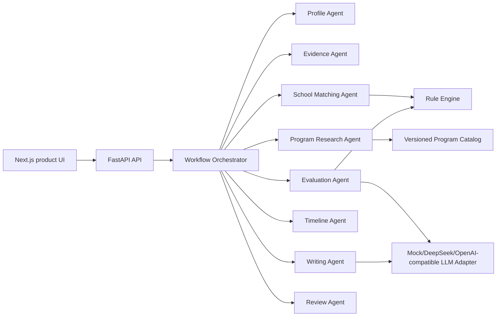

# HarborPilot AI Architecture

HarborPilot AI is a portfolio-grade implementation of a multi-agent admissions assistant for Hong Kong and Singapore taught master's applications.

## Scope

The repository intentionally implements a strong MVP rather than every enterprise feature in the original outline:

- Form-first profile assessment
- Evidence readiness review
- Deterministic eligibility rules
- Program recall against a 142-item HK/SG taught-master catalog with source coverage flags
- School matching with hard-rule gates
- Timeline backplanning
- Writing draft planning with fact bindings
- Review Agent and human gates
- Next.js product interface
- Mock LLM mode plus DeepSeek, OpenAI, and OpenAI-compatible adapter smoke path

## Runtime

## Agent Contracts

Each Agent has a narrow responsibility:

- `ProfileAgent`: standardizes form input and maps discipline tags.
- `EvidenceAgent`: computes confirmed/verified fact readiness and upload recommendations.
- `EvaluationAgent`: explains deterministic assessment results; it does not invent hard rules.
- `ProgramResearchAgent`: recalls current-cycle HK/SG programs with official-source links and field coverage metadata.
- `SchoolMatchingAgent`: ranks programs after eligibility checks.
- `TimelineAgent`: generates deadline-based tasks.
- `WritingAgent`: creates an outline and draft strategy from available facts.
- `ReviewAgent`: blocks hard-rule violations and surfaces human gates.

## Data Boundary

The catalog stores official-source entry URLs and marks most fields as `partial` because tuition, deadlines, and materials change by cycle. Production use should add official page snapshots, field-level review, and human publish gates before treating any project requirement as final.
